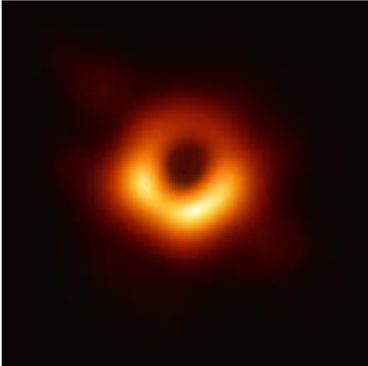
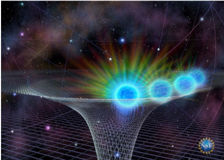

<strong>الكاتب</strong>: فادي جوزيف جرجس نصري

<strong>اسم القائد</strong>: جون بطرس و مينا

<strong>الفرقة</strong>: كشافة

<strong>نوع الموضوع</strong>: علمي

## Introduction

We’ve all heard of black holes but do we know what a black hole is? Today so will discuss what a black hole really is, its formation, composition, its inside and its death.

## Formation

Stars are massive gas clouds  and  the big mass helps the star to do nuclear fusion in their core the nuclear fusion crushes the  hydrogen  atoms to helium releasing a big amount of energy and this energy pushes against the  gravity to maintain a balance between them as long there is fusion in the core the star remain stable enough.

In the star that has more mass than our own sun the heat and the pressure allow the star fuse heavy until it reach iron but unlike any elements the fusion of the iron doesn’t generate any energy and iron built up in the center of the star until it reach a critical amount and the balance between the gravity and the radiation is suddenly broke The core collapses and the star feeds all its mass into the center and explodes in a supernova explosion so two possibilities could happen the first a normal size star become a neutron star the second a big size star that has enough mass become a black hole

## The composition 
All black hole compose of two things the event horizon & the singularity 

### I.	The event horizon

The event horizon is what you see (the black part)
Escaping from it needs to be fast as light at least and that impossible
So we see only a black sphere that reflects nothing

### II.	The singularity
If the event horizon is black part so what is the hole part 

The singularity we still aren’t sure what is the singularity all we know that all the density of the black collapses into one point in space with no volume at all or surface but we don’t know it’s like dividing by zero 

Black holes aren’t vacuum cleaners if we replace the sun with a black hole nothing will change for us except that we will freeze to death of course

## Inside a black hole 
If you fall into a black hole the experience of time is different around black holes 
From the outside you seem to slow down as you approach the event horizon so time passes slow for you as in some point you will freeze in time and tern red and disappear but from your perspective you can see the universe in fast forward like seeing into the future

## Your death:

### 1-	Quick death:

The black hole curve space so much that when you cross the event horizon you can only move in one direction it’s like being in a tight alley that closes behind you after each step & the mass of the black hole is so concentrated so even tiny distances means that gravity acts with millions of time more force on each part of your body Until you become some atoms 

### 2-	Very quick death 

When you pass the event horizon you hit a firewall and burn to ashes in an instant 

## The time in the black hole 

Tour time into a black hole depend on its mass so a small black hole could kill you before you enter the event horizon but you can travel in  a big one for a while the farther you are from the singularity the more time you live

## Black holes sizes

Black hole come in different sizes there is with the size of our sun or there is the massive black holes in the heart of each galaxy which were feeding from the beginning of the universe the biggest known black hole is s50014+81 

## The death of the black holes

As powerful as the black holes are they will eventually evaporate threw a process called hocking radiation hocking radiation is:

Empty space isn’t really empty but filled with virtual particles that pop into existence and annihilating each other so when that happen near a black hole one of the particle will be drown into the black hole and the other out and become a real particle that me that the black hole lose energy this happen slowly at first but as the black hole become smaller and when it became smaller its heat increase & in her last second it explodes like a thousand of nuclear bombs 
