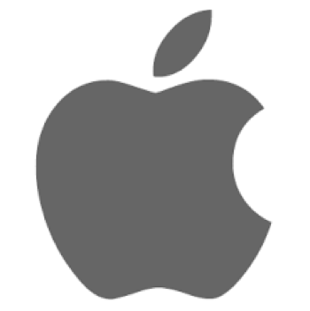

<strong>الكاتب</strong>: مايكل جورج بديع بديع

<strong>اسم القائد</strong>: جون بطرس و مينا

<strong>الفرقة</strong>: كشافة

في الأول من أبريل - 1976 تقدم “ستيف جوبز” و”ستيف وزنياك” و”رونالد وين” بطلب إلى الجهات المختصة الأمريكية لتسجيل شركة جديدة تسمى أبل كمبيوتر المحدودة -Apple Computer Inc- ولم يكن أحداً يتخيل أن هذه الشركة التي يملكها هؤلاء الشباب سوف تغير العالم. واليوم يمر 38 عاماً على تأسيس شركة أبل. فدعونا نبتعد عن الحاضر وصراعاته ونعود إلى الماضي ونرى رحلة الصعود للتفاحة المقضومة

البداية 1976

التقى “جوبز” “وزنياك” عام 1970 وأصبحا أصدقاء -كان جوبز وقتها ذو 15 عاماً- وكان “وزنياك” عبقرياً لامعاً، يستطيع تصنيع كومبيوتر بالكامل بنفسه وتطوير كل شيء فيه لكن لم يكن يملك أي مهارات تسويقية وبيعيه وأيضاً لا يملك أموالاً كافية للتصنيع، وهنا جاءت مهارات ستيف جوبز حيث تمكن من الحصول على طلبات شراء مسبقة للأجهزة وتدبير التمويل الكافي للشركة، وحان وقت تأسيس شركة، ولجأ الإثنان إلى “رونالد وين” ليقوم بدور الراعي للشركة ويأسسها ويعد الأوراق والعقود الخاصة بها وحتى أنه قام برسم أول لوجو لشركة أبل -الصورة التالية- وكتيب استخدام منتجهم الأول. وقرر “جوبز” و “وزنياك” مكافأته نظير ذلك ومنحه 10% من شركة أبل. لكن “رونالد وين” لم يكن يأمل في الاستثمار، فكان ما يبرع فيه هو تأسيس الشركات لذا فبعد أسبوعين فقط من إعلان تأسيس أبل قام ببيع أسهمه مقابل 800$ فقط -حصل لاحقاً على 1500$ ليتنازل على كل حقوقه في الشركة- أي باع “وين” حصة 10% من أبل مقابل 2300$.

الجدير بالذكر أن “وين” بعد أن أصبحت أبل كما هى الآن قام أحد الصحفيين بسؤاله هل ندم على بيع حصته التي تقدر حالياً بعشرات المليارات فرد عليه “لم أندم يوماً على هذا القرار، لقد اتخذت وقتها أفضل قرار بناءاً على المعلومات التي كانت متاحة لدي وقتها”. المهم أن شركة أبل ولدت. وكان الثلاثي متكامل فـ “وزنياك” عبقري في التصنيع لكن لا يجيد البيع وهى المهارة التي امتلكها “جوبز” وبرع فيها لكنه لم يكن يعلم كيف يحرك الأمور الإدارية فجاء دور “وين” ليتولى هذه الإجراءات

ونصل إلى التاريخ الحالي، في بداية 2007 كشف ستيف جوبز عن تغيير اسم شركته والتي ظلت 30 عاما تعرف بـ “Apple Computer Inc” وقرر جوبز إزالة كلمة “Computer” وذلك تزامناً مع إطلاق الآي فون الذي غير مفهوم العالم للهواتف، وجاءت منتجات أخرى كالتالي:

<ul>
<li>2006 أبل تعلن ماك برو -Mac Pro- وماك بوك برو -MacBook Pro-</li>
<li>2007 الإعلان عن تلفاز أبل Apple TV.</li>
<li>2007 أبل تعلن عن الجيل الأول للآي فون والآي بود تاتش.</li>
<li>2008 أبل تكشف عن خدماتها السحابية “MobileMe” والتي تحولت لاحقاً إلى iCloud.</li>
<li>2008 أبل تعلن عن ماك بوك Air.</li>
<li>2008 أبل تعلن عن Time Capsule</li>
<li>2009 أبل تعلن عن الماجيك ماوس -Magic Mouse-</li>
<li>2010 أبل تعلن عن الآي باد وبداية عصر التابلت الحقيقي.</li>
<li>2015 ابل تعلن عن اول هاتف بحواف قليله وهو iPhone x</li>
<li>وحتى اعلن عن iPhone 11 والذى يدعى الان بiPhone pro واعلن عنه منذ ثلاث ايام</li>
<li>ولكن الجديد</li>
<li>2020 ابل تعلن عن Apple Pencil</li>
</ul>

