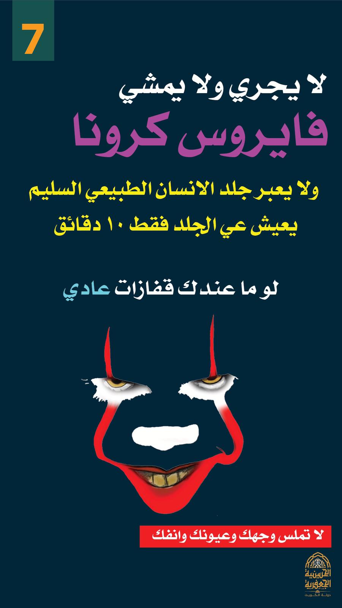
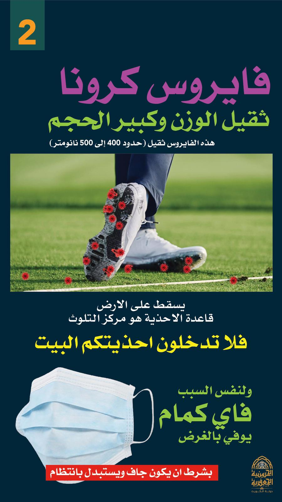
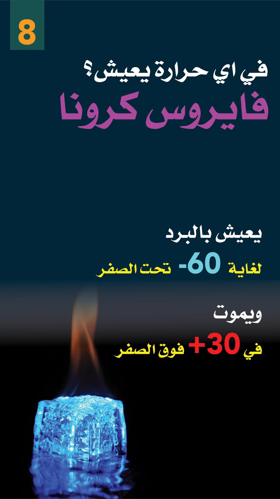
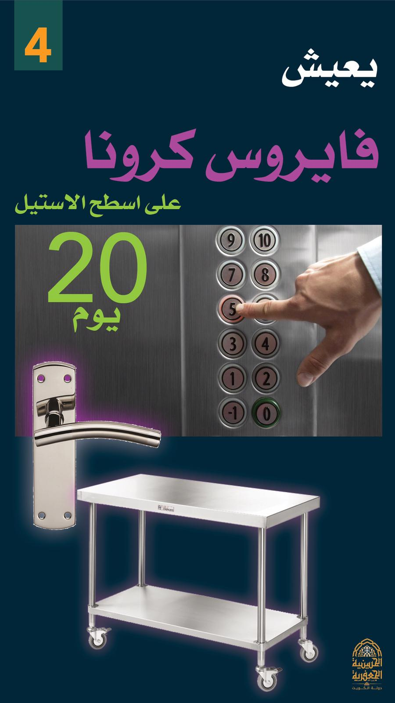
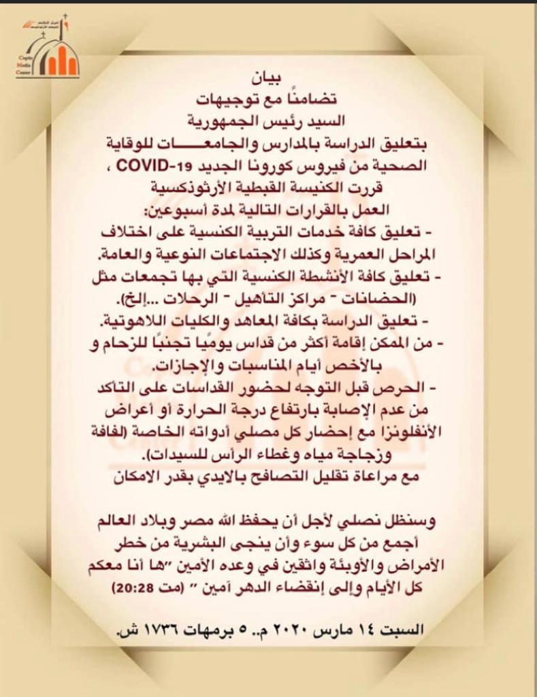
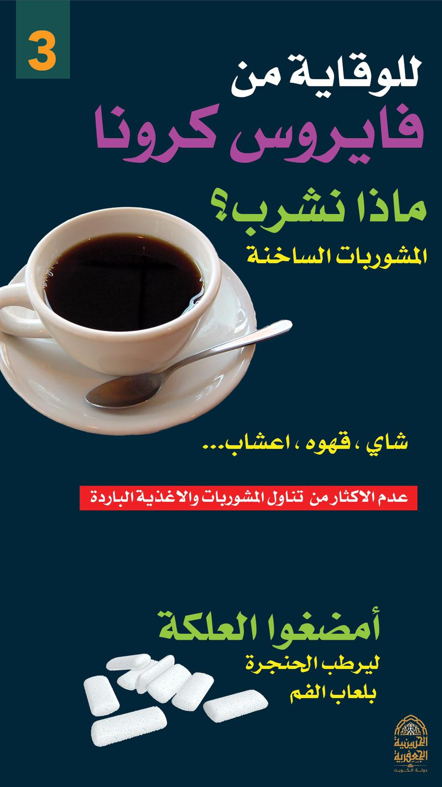

فلنصل قائلين:
“إِذَا صَارَ فِي ٱلْأَرْضِ جُوعٌ ، إِذَا صَارَ وَبَأٌ، إِذَا صَارَ لَفْحٌ أَوْ يَرَقَانٌ أَوْ جَرَادٌ جَرْدَمٌ، أَوْ إِذَا حَاصَرَهُ عَدُوُّهُ فِي أَرْضِ مُدُنِهِ ، فِي كُلِّ ضَرْبَةٍ وَكُلِّ مَرَضٍ، فَكُلُّ صَلَاةٍ وَكُلُّ تَضَرُّعٍ تَكُونُ مِنْ أَيِّ إِنْسَانٍ كَانَ مِنْ كُلِّ شَعْبِكَ إِسْرَائِيلَ، ٱلَّذِينَ يَعْرِفُونَ كُلُّ وَاحِدٍ ضَرْبَةَ قَلْبِهِ، فَيَبْسُطُ يَدَيْهِ نَحْوَ هَذَا ٱلْبَيْتِ، فَٱسْمَعْ أَنْتَ مِنَ ٱلسَّمَاءِ مَكَانِ سُكْنَاكَ وَٱغْفِرْ، وَٱعْمَلْ وَأَعْطِ كُلَّ إِنْسَانٍ حَسَبَ كُلِّ طُرُقِهِ كَمَا تَعْرِفُ قَلْبَهُ. لِأَنَّكَ أَنْتَ وَحْدَكَ قَدْ عَرَفْتَ قُلُوبَ كُلِّ بَنِي ٱلْبَشَرِ ، لِكَيْ يَخَافُوكَ كُلَّ ٱلْأَيَّامِ ٱلَّتِي يَحْيَوْنَ فِيهَا عَلَى وَجْهِ ٱلْأَرْضِ ٱلَّتِي أَعْطَيْتَ لِآبَائِنَا.” (١مل ٨: ٣٧-٤٠)
انبارافائيل

اَلْمَزَامِيرُ - اَلْمَزْمُورُُ الثَّانِي
1 لِمَاذَا ارْتَجَّتِ الأُمَمُ، وَتَفَكَّرَ الشُّعُوبُ فِي الْبَاطِلِ؟ 2 قَامَ مُلُوكُ الأَرْضِ، وَتَآمَرَ الرُّؤَسَاءُ مَعًا عَلَى الرَّبِّ وَعَلَى مَسِيحِهِ، قَائِلِينَ: 3 «لِنَقْطَعْ قُيُودَهُمَا، وَلْنَطْرَحْ عَنَّا رُبُطَهُمَا».
4 اَلسَّاكِنُ فِي السَّمَاوَاتِ يَضْحَكُ. الرَّبُّ يَسْتَهْزِئُ بِهِمْ. 5 حِينَئِذٍ يَتَكَلَّمُ عَلَيْهِمْ بِغَضَبِهِ، وَيَرْجُفُهُمْ بِغَيْظِهِ. 6 «أَمَّا أَنَا فَقَدْ مَسَحْتُ مَلِكِي عَلَى صِهْيَوْنَ جَبَلِ قُدْسِي».
7 إِنِّي أُخْبِرُ مِنْ جِهَةِ قَضَاءِ الرَّبِّ: قَالَ لِي: «أَنْتَ ابْنِي، أَنَا الْيَوْمَ وَلَدْتُكَ. 8 اسْأَلْنِي فَأُعْطِيَكَ الأُمَمَ مِيرَاثًا لَكَ، وَأَقَاصِيَ الأَرْضِ مُلْكًا لَكَ. 9 تُحَطِّمُهُمْ بِقَضِيبٍ مِنْ حَدِيدٍ. مِثْلَ إِنَاءِ خَزَّافٍ تُكَسِّرُهُمْ».
10 فَالآنَ يَا أَيُّهَا الْمُلُوكُ تَعَقَّلُوا. تَأَدَّبُوا يَا قُضَاةَ الأَرْضِ. 11 اعْبُدُوا الرَّبَّ بِخَوْفٍ، وَاهْتِفُوا بِرَعْدَةٍ. 12 قَبِّلُوا الابْنَ لِئَلاَّ يَغْضَبَ فَتَبِيدُوا مِنَ الطَّرِيقِ. لأَنَّهُ عَنْ قَلِيل يَتَّقِدُ غَضَبُهُ. طُوبَى لِجَمِيعِ الْمُتَّكِلِينَ عَلَيْهِ.

