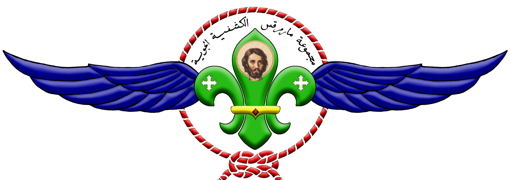
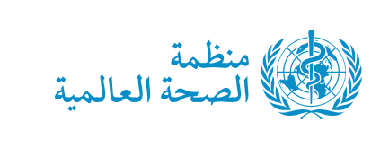

<body lang=EN-US style='tab-interval:.5in'>

 
<b>الأسئلة الشائعة حول فيروس كورونا</b><b><o:p></o:p></b>

<b> <o:p></o:p></b>

<b>إجابات على بعض الأسئلة الخاصة بالأمم المتحدة</b><b><o:p></o:p></b>

<b> <o:p></o:p></b>

<b><u>١-كيف ينتشر مرض فيروس كورونا؟</u></b><b><u><o:p></o:p></u></b>

يمكن أن يصاب الأشخاص بعدوى مرض فيروس كورونا
عن طريق الأشخاص الآخرين المصابين بالفيروس. ويمكن للمرض أن ينتقل من شخص إلى شخص عن
طريق القُطيرات الصغيرة التي تتناثر من الأنف أو الفم عندما يسعل الشخص المصاب بمرض
فيروس كورونا أو يعطس. وتتساقط هذه القُطيرات على الأشياء والأسطح المحيطة بالشخص.
ويمكن حينها أن يصاب الأشخاص الآخرون بمرض فيروس كورونا عند ملامستهم لهذه الأشياء
أو الأسطح ثم لمس عينيهم أو أنفهم أو فمهم. كما يمكن أن يصاب الأشخاص بمرض كوفيد-19
إذا تنفسوا القُطيرات التي تخرج من الشخص المصاب بالمرض مع سعاله أو زفيره. ولذا فمن
الأهمية بمكان الابتعاد عن الشخص المريض بمسافة تزيد على متر واحد (3 أقدام).<o:p></o:p>

 <o:p></o:p>

<b><u>٢-ما هي أعراض مرض كوفيد-19؟</u></b><b><u><o:p></o:p></u></b>

تتمثل الأعراض الأكثر شيوعاً لمرض كوفيد-19
في الحمى والإرهاق والسعال الجاف. وقد يعاني بعض المرضى من الآلام والأوجاع، أو احتقان
الأنف، أو الرشح، أو ألم الحلق، أو الإسهال. وعادة ما تكون هذه الأعراض خفيفة وتبدأ
تدريجياً. ويصاب بعض الناس بالعدوى دون أن تظهر عليهم أي أعراض ودون أن يشعروا بالمرض.
ويتعافى معظم الأشخاص (نحو 80%) من المرض دون الحاجة إلى علاج خاص. وتشتد حدة المرض
لدى شخص واحد تقريباً من كل 6 أشخاص يصابون بعدوى كوفيد-19 حيث يعانون من صعوبة التنفس.
وتزداد احتمالات إصابة المسنين والأشخاص المصابين بمشكلات طبية أساسية مثل ارتفاع ضغط
الدم أو أمراض القلب أو داء السكري، بأمراض وخيمة. وقد توفى نحو 2% من الأشخاص الذين
أُصيبوا بالمرض. وينبغي للأشخاص الذين يعانون من الحمى والسعال وصعوبة التنفس التماس
الرعاية الطبية.<o:p></o:p>

 <o:p></o:p>

<b><u>٣-كيف لي أن أعرف ما إذا كنت مصابا بفيروس كورونا أو مجرد إنفلونزا
شائعة؟</u></b><b><u><o:p></o:p></u></b>

عدوى الفبروس لها نفس علامات وأعراض نزلات
البرد ولا يمكنك تمييزها إلا من خلال الاختبارات المعملية لتحديد نوع الفيروس.<o:p></o:p>

 <o:p></o:p>

<b><u>٤-هل يمكن للفيروس المسبب لمرض كوفيد-19 أن ينتقل عبر الهواء؟</u></b><b><u><o:p></o:p></u></b>

تشير الدراسات التي أُجريت حتى يومنا هذا
إلى أن الفيروس الذي يسبب مرض كوفيد-19 ينتقل في المقام الأول عن طريق ملامسة القُطيرات
التنفسية لا عن طريق الهواء. انظر الإجابة عن السؤال السابق: &quot;كيف ينتشر مرض كوفيد-19؟&quot;<o:p></o:p>

 <o:p></o:p>

<b><u>٥-كيف يمكنني حماية نفسي ومنع انتشار المرض؟</u></b><b><u><o:p></o:p></u></b>

<b><u>تدابير الحماية للجميع</u></b><b><u><o:p></o:p></u></b>

اطّلع باستمرار على آخر المعلومات عن فاشية
مرض كوفيد-19 التي تُتاح على موقع المنظمة الإلكتروني والتي تصدرها سلطة الصحة العمومية
الوطنية والمحلية في بلدك. لقد سجّلت بلدان كثيرة في العالم حالات إصابة بمرض كوفيد-19،
وشهد العديد منها فاشيات. ولقد نجحت السلطات المعنية في الصين وفي بعض البلدان الأخرى
في إبطاء وتيرة انتشار فاشياتها أو وقفها تماما. ونظرا لأنه من الصعب التنبؤ بتطور
الوضع، يرجى الاطلاع بانتظام على آخر الأخبار<o:p></o:p>

 يمكنك الحد من احتمال إصابتك بمرض
كوفيد-19 أو من انتشاره باتخاذ بعض الاحتياطات البسيطة:<o:p></o:p>

☑  نظف يديك جيداً بانتظام بفركهما مطهر كحولي لليدين
أو بغسلهما بالماء والصابون.لماذا؟إن تنظيف يديك بالماء والصابون أو فركهما بمطهر كحولي
من شأنه أن يقتل الفيروسات التي قد تكون على يديك.<o:p></o:p>

☑ احتفظ بمسافة لا
تقل عن متر واحد (3 أقدام) بينك وبين أي شخص يسعل أو يعطس. لماذا؟ عندما يسعل الشخص
أو يعطس، تتناثر من أنفه أو فمه قُطيرات سائلة صغيرة قد تحتوي على الفيروس. فإذا كنت
شديد الاقتراب منه يمكن أن تتنفس هذه القُطيرات، بما في ذلك الفيروس المسبب لمرض كوفيد-19
إذا كان الشخص مصاباً به.<o:p></o:p>

☑ تجنب لمس عينيك
وأنفك وفمك،لماذا؟ تلمس اليدين العديد من الأسطح ويمكنها
أن تلتقط الفيروسات. وإذا تلوثت اليدان فإنهما قد تنقلان الفيروس إلى العينين أو الأنف
أو الفم. ويمكن للفيروس أن يدخل الجسم عن طريق هذه المنافذ ويصيبك بالمرض.<o:p></o:p>

 <o:p></o:p>

☑ تأكد من اتّباعك
أنت والمحيطين بك لممارسات النظافة التنفسية الجيدة. ويعني ذلك أن تغطي فمك وأنفك بكوعك
المثني أو بمنديل ورقي عند السعال أو العطس، ثم التخلص من المنديل المستعمل على الفور،لماذا؟ إن القُطيرات تنشر الفيروس. وباتّباع ممارسات النظافة
التنفسية الجيدة تحمي الأشخاص من حولك من الفيروسات مثل فيروسات البرد والأنفلونزا
وكوفيد-19.<o:p></o:p>

☑ إلزم المنزل إذا
شعرت بالمرض. إذا كنت مصاباً بالحمى والسعال وصعوبة التنفس، التمس الرعاية الطبية واتصل
بمقدم الرعاية قبل التوجه إليه. واتّبع توجيهات السلطات الصحية المحلية.<o:p></o:p>

لماذا؟ تتوفر للسلطات الوطنية والمحلية
أحدث المعلومات عن الوضع في منطقتك. واتصالك المسبق بمقدم الرعاية الصحية سيسمح له
بتوجيهك سريعاً إلى مرفق الرعاية الصحية المناسب. وسيسهم ذلك في حمايتك ومنع انتشار
الفيروسات وسائر أنواع العدوى.<o:p></o:p>

☑ اطلع باستمرار على
آخر تطورات مرض كوفيد-19. واتّبع المشورة التي يسديها مقدم الرعاية الصحية أو سلطات
الصحة العمومية الوطنية والمحلية أو صاحب العمل بشأن كيفية حماية نفسك والآخرين من
مرض كوفيد-19،لماذا؟ تتوفر للسلطات الوطنية والمحلية أحدث
المعلومات عما إذا كان مرض كوفيد-19 ينتشر في منطقتك. فهي الأقدر على إسداء المشورة
بشأن الإجراءات التي يمكن أن يتخذها الأشخاص في منطقتك لحماية أنفسهم.<o:p></o:p>

 <o:p></o:p>

<b><u>٦-أنا بخير وبدون أعراض. هل يجب علي استخدام
قناع؟</u></b><b><u><o:p></o:p></u></b>

وفقًا لمنظمة الصحة العالمية، بالنسبة للأفراد
الذين ليس لديهم أعراض تنفسية، لا يلزم وجود قناع طبي، حيث لا يوجد دليل على فائدته
في حماية الأشخاص غير المرضى.<o:p></o:p>

ومع ذلك، قد يتم ارتداء الأقنعة في بعض
البلدان وفقًا للعادات الثقافية المحلية. إذا تم استخدام الأقنعة
، فيجب اتباع أفضل الممارسات حول كيفية ارتدائها وإزالتها والتخلص منها وعلى
إجراءات نظافة اليدين بعد الإزالة. ولمزيد من المعلومات ،
قم بزيارة دليل منظمة الصحة العالمية حول استخدام الأقنعة في المجتمع.<o:p></o:p>

 <o:p></o:p>

<b><u>٧-ما هي احتمالات إصابتي بمرض كوفيد-19؟</u></b><b><u><o:p></o:p></u></b>

يتوقف الخطر على المكان الذي تتواجد فيه،
وبشكل أكثر تحديدًا، ما إذا كانت عدوى كوفيد-19 تتفشي في
هذا المكان.<o:p></o:p>

وبالنسبة لمعظم الناس في معظم الأماكن،
لا يزال خطر الإصابة بعدوى مرض كوفيد-19 ضعيفا. ومع ذلك، هناك بعض الأماكن في العالم
(مدن أو مناطق) التي ينتشر فيها المرض حاليا. ويكون خطر الإصابة بعدوى مرض كوفيد-19
أعلى لدى الأشخاص الذين يعيشون في هذه المناطق أو يزورونها. وتتخذ الحكومات والسلطات
الصحية حاليا إجراءات صارمة كلما كُشف عن حالة إصابة جديدة بمرض كوفيد-19. لذا، تأكّد
من التزامك بأي قيود تُفرض محليا على السفر أو التنقل أو التجمعات الكبيرة. فالتعاون
مع الجهات المعنية بمكافحة الأمراض من شأنه أن يحدّ من خطر الإصابة بمرض كوفيد-19 وانتشاره.<o:p></o:p>

وبالنسبة لمعظم الناس في معظم الأماكن،
لا يزال خطر الإصابة بعدوى مرض كوفيد-19 ضعيفا. ومع ذلك، هناك بعض الأماكن في العالم
(مدن أو مناطق) التي ينتشر فيها المرض حاليا. ويكون خطر الإصابة بعدوى مرض كوفيد-19
أعلى لدى الأشخاص الذين يعيشون في هذه المناطق أو يزورونها. وتتخذ الحكومات والسلطات
الصحية حاليا إجراءات صارمة كلما كُشف عن حالة إصابة جديدة بمرض كوفيد-19. لذا، تأكّد
من التزامك بأي قيود تُفرض محليا على السفر أو التنقل أو التجمعات الكبيرة. فالتعاون
مع الجهات المعنية بمكافحة الأمراض من شأنه أن يحدّ من خطر الإصابة بمرض كوفيد-19 وانتشاره.<o:p></o:p>

ويمكنك الاطلاع عليها من خلال الرابط التالي:
<a href="https://www.who.int/emergencies/diseases/novel-coronavirus-2019/situation-reports/">https://www.who.int/emergencies/diseases/novel-coronavirus-2019/situation-reports/</a> 
 باللغة الانجليزية <o:p></o:p>

 <o:p></o:p>

<b><u>٨-هل النساء الحوامل أكثر عرضة لفيروس كورونا وهل سيؤذي الجنين؟</u></b><b><u><o:p></o:p></u></b>

ليس لدينا معلومات من التقارير العلمية
المنشورة حول قابلية النساء الحوامل للإصابة بفيروس كورونا، وتعاني النساء الحوامل
من تغيرات مناعية وفسيولوجية، مما قد يجعلهن أكثر عرضة للإصابة بالالتهابات التنفسية
الفيروسية، بما في ذلك فيروس كورونا.<o:p></o:p>

يعتقد أن الفيروس الذي يسبب فيروس كورونا
ينتشر بشكل رئيسي عن طريق الاتصال الوثيق مع شخص مصاب من خلال قطرات الجهاز التنفسي،
ما إذا كانت المرأة الحامل المصابة بالفيروس يمكنها نقل الفيروس الذي يسبب فيروس كورونا
إلى جنينها أو حديثي الولادة بطرق أخرى للانتقال الرأسي (قبل أو أثناء أو بعد الولادة)
لا يزال غير معروف.<o:p></o:p>

 <o:p></o:p>

<b><u>٩-ما هو خطر إصابة طفلي بمرض فيروس كورونا؟</u></b><b><u><o:p></o:p></u></b>

استنادًا إلى الأدلة المتاحة، لا يبدو أن
الأطفال أكثر عرضة للإصابة بـفيروس كورونا من البالغين، ولكن في حين أن بعض الأطفال
والرضع أصيبوا بمرض فيروس كورونا، فإن البالغين يشكلون معظم الحالات المعروفة حتى الآن.
ويمكنك معرفة المزيد عن الأشخاص الأكثر عرضة لخطر المشاكل الصحية إذا كان لديهم عدوى
الفيروس في صفحة تقييم المخاطر الحالية لمركز السيطرة على الأمراض.<o:p></o:p>

 <o:p></o:p>

<o:p>&nbsp;</o:p>

<b><u>١٠-هل تختلف أعراض الفيروس لدى الأطفال
عن البالغين؟</u></b><b><u><o:p></o:p></u></b>

ان أعراضالفيروس متشابهة عند الأطفال والبالغين.
ومع ذلك ، فإن الأطفال الذين يعانون من الفيروس المؤكد لديهم
أعراض خفيفة بشكل عام. وتشمل الأعراض المبلغ عنها لدى الأطفال أعراضًا تشبه نزلات البرد،
مثل الحمى وسيلان الأنف والسعال، وتم الإبلاغ عن القيء والإسهال. من غير المعروف حتى
الآن ما إذا كان بعض الأطفال قد يكونون أكثر عرضة للإصابة بأمراض خطيرة، على سبيل المثال،
الأطفال الذين يعانون من حالات طبية أساسية واحتياجات رعاية صحية خاصة. وهناك الكثير
مما يمكن تعلمه حول كيفية تأثير المرض على الأطفال.<o:p></o:p>

 <o:p></o:p>

<b><u>١١-هل ينبغي أن أشعر بالقلق من الإصابة بمرض كوفيد-19؟</u></b><b><u><o:p></o:p></u></b>

إن المرض الذي تسببه العدوى بفيروس كورونا
المستجد (كوفيد-19) خفيف بشكل عام، لاسيما عند الأطفال والشباب. ومع ذلك، فإنه يمكن
أن يسبب مرضًا خطيرًا، إذ يحتاج نحو شخص واحد من كل 5 أشخاص مصابين بهذا المرض إلى
تلقّي الرعاية في المستشفى. لذا، فإن من الطبيعي أن يشعر الناس بالقلق إزاء كيفية تأثير
فاشية مرض كوفيد-19 عليهم وعلى أحبائهم.<o:p></o:p>

ويمكننا توجيه قلقنا على النحو الصحيح بتحويله
إلى إجراءات لحماية أنفسنا وأحبائنا ومجتمعاتنا المحلية. وعلى رأس هذه الإجراءات غسل
اليدين بشكل منتظم ومسهب واتّباع ممارسات النظافة التنفسية الجيدة. ثانيا، الاطلاع
على مشورة السلطات الصحية المحلية والتقيّد بها، بما في ذلك القيود التي قد تُفرض على
السفر والتنقل والتجمعات.<o:p></o:p>

 <o:p></o:p>

<b><u>١٢-من هم الأشخاص المعرضون لخطر الإصابة بمرض وخيم؟</u></b><b><u><o:p></o:p></u></b>

مازلنا نتعرف على تأثير مرض كوفيد-19 على
الناس، ومع ذلك فيبدو أن المسنين والأشخاص المصابين بحالات طبية موجودة مسبقاً (مثل
ارتفاع ضغط الدم وأمراض القلب وداء السكري) يصابون بمرض وخيم أكثر من غيرهم.<o:p></o:p>

 <o:p></o:p>

<b><u>١٣-هل المضادات الحيوية فعّالة في الوقاية من مرض كوفيد-2019 أو علاجه؟</u></b><b><u><o:p></o:p></u></b>

لا. لا تقضي المضادات الحيوية على الفيروسات،
فهي لا تقضي إلا على العدوى الجرثومية. وبما أن مرض كوفيد-19 سببه فيروس، فإن المضادات
الحيوية لا تقضي عليه. فلا ينبغي استعمال المضادات الحيوية كوسيلة للوقاية من مرض كوفيد-19
أو علاجه. ولا ينبغي استعمالها إلا وفقاً لتعليمات الطبيب لعلاج حالات العدوى الجرثومية.<o:p></o:p>

 <o:p></o:p>

<b><u>١٤-هل توجد أي أدوية أو علاجات يمكنها الوقاية من مرض كوفيد-19 أو علاجه؟</u></b><b><u><o:p></o:p></u></b>

في حين قد تريح بعض الأدوية الغربية أو
التقليدية أو المنزلية من بعض أعراض كوفيد-19 أو تخففها، فليست هناك بيّنة على وجود
أدوية حالياً من شأنها الوقاية من هذا المرض أو علاجه. ولا توصي المنظمة بالتطبيب الذاتي
بواسطة أي أدوية، بما في ذلك المضادات الحيوية، سواء على سبيل الوقاية من مرض كوفيد-19
أو معالجته. غير أن هناك عدة تجارب سريرية جارية تتضمن أدوية غربية وتقليدية معاً.
وستواصل المنظمة إتاحة معلومات محدّثة بهذا الشأن عندما تتوفر النتائج السريرية.<o:p></o:p>

 <o:p></o:p>

<o:p>&nbsp;</o:p>

<o:p>&nbsp;</o:p>

<o:p>&nbsp;</o:p>

<b><u>١٥-هل هناك لقاح أو دواء أو علاج لمرض كوفيد-2019؟</u></b><b><u><o:p></o:p></u></b>

ليس بعد. لا يوجد حتى يومنا هذا لقاح ولا
دواء محدد مضاد للفيروسات للوقاية من مرض كوفيد-2019 أو علاجه. ومع ذلك، فينبغي أن
يتلقى المصابون به الرعاية لتخفيف الأعراض. وينبغي إدخال الأشخاص المصابين بمرض وخيم
إلى المستشفيات. ويتعافى معظم المرضى بفضل الرعاية الداعمة.<o:p></o:p>

ويجري حالياً تحري بعض اللقاحات المحتملة
والأدوية الخاصة بعلاج هذا المرض تحديداً. ويجري اختبارها عن طريق التجارب السريرية.
وتقوم المنظمة بتنسيق الجهود المبذولة لتطوير اللقاحات والأدوية للوقاية من مرض كوفيد-19
وعلاجه.<o:p></o:p>

وتتمثل السبل الأكثر فعّالية لحماية نفسك
والآخرين من مرض كوفيد-19 في المواظبة على تنظيف اليدين، وتغطية الفم عند السعال بثني
المرفق أو بمنديل ورقي، والابتعاد مسافة لا تقل عن متر واحد (3 أقدام) عن الأشخاص الذين
يسعلون أو يعطسون. (انظر كيف يمكنني حماية نفسي ومنع انتشار المرض؟).<o:p></o:p>

 <o:p></o:p>

<b><u>١٦-هل ينبغي أن أضع كمامة لحماية نفسي؟</u></b><b><u><o:p></o:p></u></b>

لا تضع كمامة إلا إذا ظهرت عليك أعراض مرض
كوفيد-19 (خاصة السعال) أو إذا كنت تقدم الرعاية لشخص يُحتمل أنه مصاب بهذا الـمرض.
ولا يمكنك استعمال الكمامة وحيدة الاستعمال إلا مرة واحدة. أما إذا لم تكن مريضا أو
إذا قائما على رعاية شخص مريض، فستكون قد أهدرت كمامة دون داع. ونظرا للنقص في إمدادات
الكمامات على الصعيد العالمي، فإن المنظمة تحث الناس على التحلي بالحكمة في استخدامها.<o:p></o:p>

وتنصح المنظمة باستخدام الكمامات استخداما
رشيدا لتفادي إهدار الموارد الثمينة دون داع وإساءة استخدامها (انظر الإرشادات بشأن
استخدام الكمامات).<o:p></o:p>

وتتمثل السبل الأكثر فعّالية لحماية نفسك
والآخرين من مرض كوفيد-19 في المواظبة على تنظيف اليدين، وتغطية الفم عند السعال بثني
المرفق أو بمنديل ورقي، والابتعاد مسافة لا تقل عن متر واحد (3 أقدام) عن الأشخاص الذين
يسعلون أو يعطسون. انظر تدابير الحماية للاطلاع على المزيد من المعلومات.<o:p></o:p>

 <o:p></o:p>

<b><u>١٧-إلى متى يجب أن أرتدي قناعًا بعد التعافي من مرض بالجهاز التنفسي؟</u></b><b><u><o:p></o:p></u></b>

لتجنب إصابة الآخرين، يجب أن تستخدم قناعًا
لطالما كنت لا تزال تسعل أو تعطس. ويجب التوقف فقط بعد الشفاء التام (مما يعني
24-48 ساعة بعد عدم وجود أعراض بدون دواء).<o:p></o:p>

 <o:p></o:p>

<b><u>١٨-أنا أعتني بشخص مريض مشتبه به أو مؤكد باصابته بفيروس كورونا. ما
الاحتياطات التي يجب علي اتخاذها؟</u></b><b><u><o:p></o:p></u></b>

☑ يجب أن تحد من الحركة
حول المنزل وتقليل المساحة المشتركة.<o:p></o:p>

☑ تأكد من تهوية المساحات
المشتركة مثل الحمامات والمطبخ جيدًا. إحدى الطرق للقيام بذلك هي عن طريق إبقاء النوافذ
مفتوحة. قم بتنظيف وتطهير سطح الحمام والمرحاض مرة واحدة على الأقل في اليوم باستخدام
صابون أو منظف منزلي عادي للتنظيف ثم التطهير بمطهر منزلي عادي يحتوي على 0.5 ٪ هيبوكلوريت
الصوديوم.<o:p></o:p>

☑ لا تنس أهمية نظافة
اليدين بفرك اليدين بالصابون والكحول والماء (إذا كانت اليدين متسخة بشكل واضح).<o:p></o:p>

☑ ينبغي على أفراد
الأسرة ، كلما أمكن ذلك، البقاء في غرفة مختلفة أو الحفاظ
على مسافة لا تقل عن متر واحد عن الشخص المريض.<o:p></o:p>

☑ عند المساعدة في
رعاية الشخص المريض، ارتد قناعًا طبيًا أو جراحيًا محكمًا يغطي أنفك وفمك عندما يكون
في نفس الغرفة مع الشخص المصاب. وتأكد من الحرص على عدم لمس القناع الخاص بك. إذا أصبح
القناع مبللاً أو متسخًا، فيجب استبداله. عند إزالة القناع، من المهم التخلص منه وإجراء
نظافة اليدين. تخلص من أي مادة بها إفرازات تنفسية بعد الاستخدام مباشرة.<o:p></o:p>

☑ يجب أن تقوم أنت
والمريض، بصفتك مقدم الرعاية، بنظافة اليدين بعد الاتصال بإفرازات الجهاز التنفسي.<o:p></o:p>

 <o:p></o:p>

<b><u>١٩-كم تستغرق فترة حضانة مرض كوفيد-19؟</u></b><b><u><o:p></o:p></u></b>

مصطلح &quot;فترة الحضانة&quot; يشير إلى
المدة من الإصابة بالفيروس إلى بدء ظهور أعراض المرض. وتتراوح معظم تقديرات فترة حضانة
مرض كوفيد-19 ما بين يوم واحد و14 يوماً، وعادة ما تستمر خمسة أيام. وستُحدّث هذه التقديرات
كلما توفر المزيد من البيانات.<o:p></o:p>

 <o:p></o:p>

<b><u>٢٠-هل يمكن أن تنتقل عدوى مرض كوفيد-19 إلى البشر من مصدر حيواني؟</u></b><b><u><o:p></o:p></u></b>

فيروسات كورونا هي فصيلة كبيرة من الفيروسات
الشائعة بين الخفافيش والحيوانات. ويصاب الأشخاص في حالات نادرة بعدوى هذه الفيروسات
التي ينقلونها بعد ذلك إلى الآخرين. ومن الأمثلة على ذلك أن فيروس كورونا المسبب لمتلازمة
الالتهاب الرئوي الحاد الوخيم (سارس) الذي ارتبط بقطط الزباد، وفيروس كورونا المسبب
لمتلازمة الشرق الأوسط التنفسية الذي انتقل طريق الإبل. ولم تتأكد بعد المصادر الحيوانية
المحتملة لمرض كوفيد-19.<o:p></o:p>

 <o:p></o:p>

<b><u>٢١-كم من الوقت يظل الفيروس حياً على الأسطح؟</u></b><b><u><o:p></o:p></u></b>

لا يُعرف على وجه اليقين فترة استمرار الفيروس
المسبب لمرض كوفيد-19 حياً على الأسطح، ولكن يبدو أنه يشبه في ذلك سائر فيروسات كورونا.
وتشير الدراسات إلى أن فيروسات كورونا (بما في ذلك المعلومات الأولية عن الفيروس المسبب
لمرض كوفيد-19) قد تظل حية على الأسطح لبضع ساعات أو لعدة أيام. وقد يختلف ذلك باختلاف
الظروف (مثل نوع السطح ودرجة الحرارة أو الرطوبة البيئية).<o:p></o:p>

إذا كنت تعتقد أن سطحاً ما قد يكون ملوثاً،
نظفه بمطهر عادي لقتل الفيروس وحماية نفسك والآخرين. ونظف يديك بفركهما بمطهر كحولي
أو بغسلهما بالماء والصابون. وتجنب لمس عينيك أو فمك أو أنفك.<o:p></o:p>

 <o:p></o:p>

<b><u>٢٢-كيف يمكنني الخضوع لاختبار فيروس كورونا؟</u></b><b><u><o:p></o:p></u></b>

إذا كنت بخير، لا يوصى بإجراء أي اختبار،
أما  إذا كنت تعاني
من أعراض الفيروس ، يجب عليك عزل نفسك على الفور عن الآخرين، والاتصال بعيادة أو منشأة
طبية محلية تابعة للأمم المتحدة لإبلاغهم بحالتك وتاريخ السفر والتعرض ذي الصلة. إذا
تم التعرف عليك كجهة اتصال وثيقة من قبل وزارة الصحة المحلية أو منظمة الصحة العالمية  فيرجى توضيح ذلك
أيضًا. من هنا سيتم إعلامك إذا كان التقييم الطبي ضروريًا وكيفية إجراء الاختبار.<o:p></o:p>

 <o:p></o:p>

<b><u>٢٣-ما البدائل المتوفرة لدي في حالة عدم توفر معقمات لليدين؟ هل يمكنني
استخدام كحوليات أخرى مثل الإيثيل؟</u></b><b><u><o:p></o:p></u></b>

في حالة عدم توفر معقم اليدين، فإن غسل
اليدين بالماء والصابون هو البديل الموصى به، بل والأفضل من ذلك. بالنسبة للخمور فانها
ليست فعالة ضد فيروس كورونا. لكي يكون فرك اليد القائم على الكحول فعالاً، يجب أن يحتوي
على محتوى كحولي من 60٪ إلى 95٪.<o:p></o:p>

 <o:p></o:p>

<b><u>٢٤-هل يمكن للأشخاص الذين يتعافون فيروس كورونا أن يصابوا به مرة أخرى؟</u></b><b><u><o:p></o:p></u></b>

نحن نعلم أنه بالنسبة للفيروسات المماثلة
لفيروس كورونا، من غير المرجح أن تتم إعادة إصابة الأشخاص المصابين بعد فترة قصيرة
من شفائهم. ومع ذلك ، نظرًا لأن الاستجابة المناعية لفيروس
كورونا  لم تُفهم بعد، فمن غير المعروف حتى
الآن ما إذا كان سيتم ملاحظة حماية مناعية مماثلة للمرضى الذين تعافوا منه.<o:p></o:p>

 <o:p></o:p>

<b><u>٢٥-هل من الآمن تلقي الطرود من المناطق التي أبلغت عن حالات إصابة بمرض
كوفيد-19؟</u></b><b><u><o:p></o:p></u></b>

نعم. إن احتمالات تلوث السلع التجارية عن
طريق شخص مصاب بالعدوى هي احتمالات ضعيفة، كما أن مخاطر الإصابة بالفيروس الذي يسبب
مرض كوفيد-19 عن طريق طرد نُقل وشُحن وتعرض لمختلف الظروف ودرجات الحرارة، هي مخاطر
ضئيلة.<o:p></o:p>

 <o:p></o:p>

<b><u>٢٦-هل هناك علاقة بين فيروس كورونا ودرجة حرارة البيئة؟</u></b><b><u><o:p></o:p></u></b>

من غير المعروف حتى الآن ما إذا كان تغير
الطقس ودرجة الحرارة يؤثران أو لهما أي ارتباط بفيروس كورونا. في هذا الوقت ، ليس من الواضح أو المعروف ما إذا كان انتشارالفيروس سينخفض
عندما يصبح الطقس أكثر دفئًا.<o:p></o:p>

 <o:p></o:p>

<b><u>٢٧-هل يمكنني التقاط الفيروس من مكان مغلق (أي حافلة أو مترو أنفاق)
بالقرب من شخص لا يعاني من أعراض تنفسية؟</u></b><b><u><o:p></o:p></u></b>

نظرًا لأن الفيروس ينتقل عن طريق قطرات
الجهاز التنفسي، فإن خطر الإصابة به من شخص غير مصحوب بأعراض، حتى الاتصال بحالة فيروس
كورونا المؤكدة، منخفض. ومع ذلك ، في ضوء الوباء، يجب على
الجميع الحفاظ على التباعد الاجتماعي، مما يعني الابتعاد على الأقل مترًا واحدًا عن
الآخرين، وتجنب التجمعات الجماعية والمناطق التي بها أعداد كبيرة من الناس، وممارسة
غسل اليدين وتعقيم اليدين بشكل متكرر وفقًا للتوصية.<o:p></o:p>

 <o:p></o:p>

<b><u>٢٨-هل يجب أن أبدأ بتجنب المنحدرين من أصل آسيوي وأعمالهم؟</u></b><b><u><o:p></o:p></u></b>

يمكن أن يؤثر الفيروس على أي شخص بغض النظر
عن الجنسية والعرق واللون.و لن تتسامح المنظمة مع التمييز
وتشجع الجميع على تعزيز المشاركة المجتمعية الملائمة ثقافياً والتعاطفية واكتشاف التصورات
العامة السلبية والتصدي لها بسرعة والتصدي للمعلومات المضللة.<o:p></o:p>

 <o:p></o:p>

<b><u>٢٩-متى يجب أن نعتبر أنفسنا &quot;مرضى&quot; ونبقى في المنزل؟</u></b><b><u><o:p></o:p></u></b>

على الرغم من أن الحمى علامة أكيدة على
أنك مريض بما يكفي لعدم القدوم إلى العمل، فإن أي شخص يعاني من أعراض تنفسية مثل السعال
والعطس يجب أن يبقى في المنزل.<o:p></o:p>

 <o:p></o:p>

<b><u>٣٠-زميلي مريض لكنه يصر على أنه نزلة برد فقط وهو متردد في العمل من
المنزل. ما هي الخطوات التي يمكننا اتخاذها لفرض &quot;البقاء في المنزل عندما لا تكون
جيدًا&quot; بين الموظفين؟</u></b><b><u><o:p></o:p></u></b>

في حين أنه من المحتمل جدًا أن يكون زميلك
يعاني فقط من نزلات البرد أو الأنفلونزا، إلا أنه يجب اتخاذ جميع الاحتياطات، ويجب
على المديرين تشجيع الموظفين الذين يعانون من أعراض الأنفلونزا على العمل عن بعد لبعض
الوقت حتى تختفي الأعراض. وبدلاً من ذلك ، إذا كان الموظف
يشعر بعدم اللياقة، فيجب عليه أخذ إجازة مرضية. ان هذا نهج منطقي في أي وقت لمنع انتشار
الإنفلونزا أو الفيروسات الموسمية الأخرى. كما يتم تشجيع المشرفين على ممارسة المرونة
في العمل فيما يتعلق باستخدام ترتيبات العمل عن بعد إذا كان الموظف يرغب في الحد من
اتصاله بالآخرين والعمل من المنزل.<o:p></o:p>

 <o:p></o:p>

<b><u>٣١-ماذا يمكننا أن نفعل إذا لم يكن لدينا أي مطهرات يدوية في مبنى المكاتب؟</u></b><b><u><o:p></o:p></u></b>

يجب عليك الاتصال بخدمة إدارة المرافق في
مركز العمل أو المنظمة أو إدارة المبنى المحلية التابعة للأمم المتحدة.<o:p></o:p>

 <o:p></o:p>

<b><u>٣٢-ما هي عملية تقييم مدى أهمية الرحلات والاجتماعات الرسمية؟</u></b><b><u><o:p></o:p></u></b>

يوصي مدير الخدمات الطبية في الأمم المتحدة
بأن يقوم المدراء في الأمم المتحدة و الموظفون بإجراء تقييم
للمخاطر لتقييم مدى خطورة السفر المقترح المتوازن مقابل المخاطر على المسافر لأي سفر
أو اجتماعات في المناطق المتضررة التي تعاني من النقل المستمر لفيروس كورونا.<o:p></o:p>

 <o:p></o:p>

<b><u>٣٣-هل لدى الأمم المتحدة أي إرشادات محددة لمنظمي الاجتماعات والتجمعات
الجماعية والمشاركين خلال تفشي فيروس كورونا؟</u></b><b><u><o:p></o:p></u></b>

بالنسبة للاجتماعات خلال تفشي فيروس كورونا،
أعدت شعبة إدارة الرعاية الصحية والسلامة والصحة المهنية الإرشادات التالية لمنظمي
الاجتماعات والمشاركين المتوفرة في بوابة الموارد البشرية للأمم المتحدة. وينبغي أن
تستخدم مكاتب الأمم المتحدة هذه المبادئ التوجيهية العالمية لتطوير المبادئ التوجيهية
المحلية وفقاً لتشريعات البلد المضيف.<o:p></o:p>

أصدرت منظمة الصحة العالمية كذلك توجيهًا
مؤقتًا يتضمن توصيات التخطيط الرئيسية للتجمعات الجماعية في سياق تفشي فيروس كورونا
الحالي.<o:p></o:p>

 <o:p></o:p>

<b><u>٣٤-أخطط للسفر لعقد اجتماع في البلدان أو الأقاليم التي تشهد حاليًا
انتقالا محليا لفيروس كورونا، هل يجب أن ألغي هذا السفر أو الاجتماع؟</u></b><b><u><o:p></o:p></u></b>

بينما لا توصي منظمة الصحة العالمية وتنصح
بعدم تطبيق أي قيود على السفر استنادًا إلى المعلومات المتاحة حاليًا عن فيروس كورونا،
كإجراء للصحة المهنية، فمن المستحسن أن يتولى مدراء الأمم المتحدة والموظفين جميع السفر
الرسمي. ان تقييم المخاطر لتقييم مدى أهمية السفر المقترح متوازنًا مع المخاطر التي
يتعرض لها المسافر لأي سفر إلى أو اجتماعات في المناطق المتأثرة التي تعاني من الإنتقال
المستمر لفيروس كورونا. وهذا يشمل المخاطر التي تفرضها القضايا الطبية والقيود المتطورة
على السفر أو الحدود التي تفرضها الدول الأطراف.<o:p></o:p>

يرجى العلم بأن السلطات المحلية قد تبدأ
في تطبيق قيود السفر وإجراءات الفحص الصحي للمسافرين الذين يدخلون أو يخرجون من البلاد.
ويجب على جميع موظفي الأمم المتحدة الذين يخططون للسفر التحقق من سفارة أو قنصلية أو
وزارة الصحة في دول المقصد ومواكبة النصائح الصحية المحلية قبل وأثناء سفرك، ويجب عليك
كذلك الامتثال لأية إجراءات فحص وضعتها السلطات المحلية.<o:p></o:p>

مع تطور الجائحة، قد يكون من الصعب التنبؤ
بالوضع على الصعيد العالمي، وسيكون من الحكمة اتخاذ ترتيبات طارئة إذا دعت الحاجة.
لا تتردد في التشاور معنا عبر البريد الالكتروني:  dos-dhmosh-public-health@un.org حسب
الحاجة.<o:p></o:p>

 <o:p></o:p>

<o:p>&nbsp;</o:p>

<b><u>٣٥-ما هو بروتوكول الموظفين العائدين إلى العمل بعد زيارة البلدان المتضررة
من فيروس كورنا (أي تلك التي تنتقل باستمرار)؟</u></b><b><u><o:p></o:p></u></b>

☑ إذا كنت قد عدت
لتوك من منطقة مصابة، فيجب عليك المراقبة الذاتية للأعراض لمدة 14 يومًا بعد السفر.<o:p></o:p>

☑ خلال تلك الفترة،
يجب عليك طلب الرعاية الطبية فورًا إذا ظهرت لديك أي علامات وأعراض، مثل ضيق التنفس
أو السعال.<o:p></o:p>

☑ تذكر مشاركة تاريخ
سفرك السابق مع مقدم الرعاية الصحية الخاص بك وبذل كل جهد لإبلاغهم عبر الهاتف قبل
زيارة منشأة طبية وارتداء قناع طبي عند طلب الرعاية الطبية.<o:p></o:p>

☑  يجب عليك العودة إلى العمل فقط عندما تكون في حالة
جيدة وخالية تمامًا من الأعراض.<o:p></o:p>

☑ يتم تشجيع موظفي
ومديري الموارد البشرية على ممارسة المرونة حول العمل عن بعد لدعم الموظفين.<o:p></o:p>

 <o:p></o:p>

<b><u>٣٦-لقد عدت لتوي من السفر من بلد أو منطقة تعاني من انتقال محلي لفيروس
كورونا. أنا بخير وليس لدي أي أعراض. هل يمكنني العودة إلى مكان العمل؟</u></b><b><u><o:p></o:p></u></b>

☑ بالنسبة لأي من
موظفي الأمم المتحدة الذين لا يعانون من الأعراض، والعودة من بلد أو منطقة أو إقليم
يعانون من انتقال محلي لفيروس كورونا، يتم تشجيع المديرين على ممارسة المرونة فيما
يتعلق باستخدام ترتيبات العمل عن بعد للموظفين في هذه الحالات الذين يرغبون في الحد
تواصلهم مع الآخرين والعمل من المنزل لمدة 14 يومًا بعد السفر. هذا ليس إلزاميًا ولكن
يتم تشجيعه بشدة.<o:p></o:p>

☑ يجب أن ينصح الأفراد
العائدون من مناطق تفشي المرض بمراجعة الاستشارة الصحية الخاصة بنا على الصفحة الخاصة
بمرض فيروس كورونا، بحيث يكون لديك وعي بالمرض. يجب أن تراقب نفسك يوميًا بحثًا عن
علامات الحمى، وأعراض الجهاز التنفسي (على سبيل المثال، صعوبات التنفس، والسعال)، ومعرفة
مكان التماس العناية الطبية إذا كنت على دراية بأي أعراض في نفسك. ويجب أن تراقب نفسك
لمدة 14 يومًا على الأقل بعد السفر.<o:p></o:p>

 <o:p></o:p>

<b><u>٣٧-ماذا عن الحجز الذاتي بعد العودة من منطقة أو بلد ينتشر فيه المرض؟</u></b><b><u><o:p></o:p></u></b>

☑ إذا كنت قد عدت
لتوك من منطقة مصابة، فيجب عليك المراقبة الذاتية للأعراض لمدة 14 يومًا بعد السفر.
وخلال تلك الفترة، يجب عليك طلب الرعاية الطبية فورًا إذا ظهرت لديك أي علامات وأعراض،
مثل ضيق التنفس أو السعال.<o:p></o:p>

☑ يوصى بالحجر الذاتي
لمدة 14 يومًا عندما تعرضت للمناطق المصابة.<o:p></o:p>

</body>